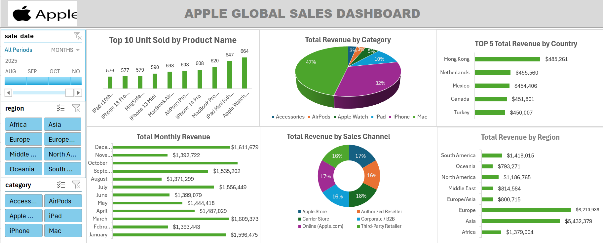
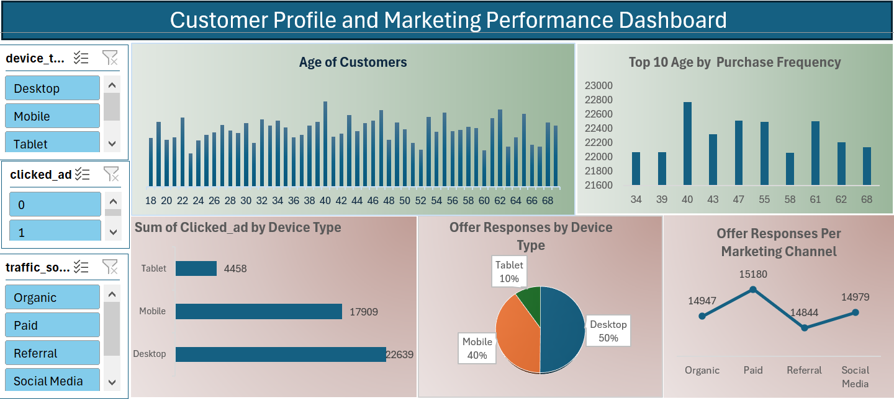
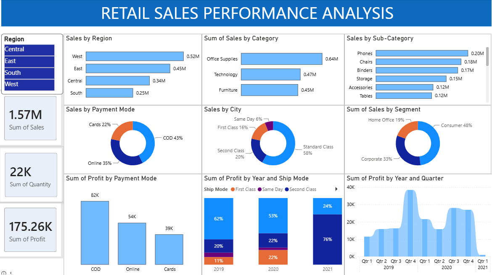
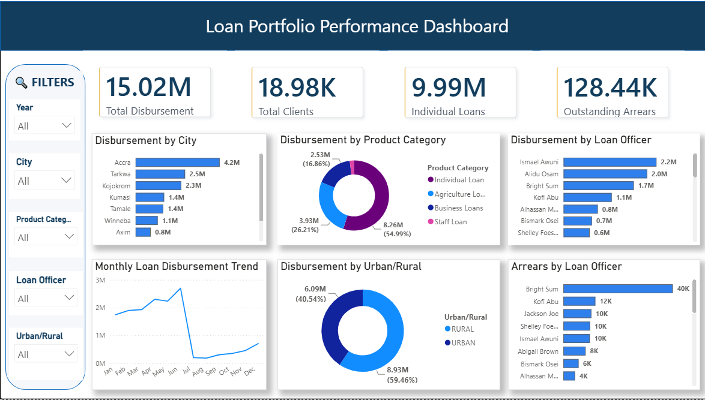

# Data Analytics Project

# Project 1

 Title: [Apple Global Sales Dashboard](https://github.com/cosei-creator/github.io-cosei-creator/blob/main/Apple_Global_Sales_Dashboard.xlsx)

**Tools Used**: Microsoft Excel(Filters, PivotTables, PivotCharts, Conditional Formatting, Timeline Slicer, Slicers, Bar & Column Charts, Shapes & Icons, Progress Chart, Donut & Pie Charts, Gridline Removal)

**Project Description**: This project presents an interactive Apple Global Sales Dashboard developed in Microsoft Excel to analyse global sales performance across products, regions, sales channels, and time periods. The dashboard consolidates key sales metrics into a single, user-friendly interface, enabling stakeholders to monitor performance, identify sales trends, and compare results across multiple business dimensions.
The dashboard provides a comprehensive overview of revenue distribution, product performance, regional sales, and customer purchasing patterns through dynamic visualisations and interactive filtering capabilities. Addtionally, it is designed to support data-driven decision-making by allowing users to explore sales data from different perspectives and uncover meaningful business insights. The dashboard includes the following features:

Top 10 Units Sold by Product: Highlights the best-performing Apple products based on the total number of units sold.

Total Revenue by Category: Displays the contribution of each product category to overall revenue.

Top 5 Revenue by Country: Compares the highest-performing countries based on total sales revenue.

Monthly Revenue Analysis: Tracks revenue performance throughout the year to identify seasonal sales trends.

Revenue by Sales Channel: Analyses revenue generated across different sales channels, including Apple Stores, Online, Corporate, Authorised Resellers, Carrier Stores, and Third-Party Retailers.

Revenue by Region: Provides a geographical overview of revenue performance across global regions.

Interactive Features
The dashboard includes dynamic slicers and a timeline that allow users to filter the analysis by: Sales Date (Month and Year), Region, and Product Category.

**Key findings**:
Regional Performance: Identified the highest-performing regions and countries based on total revenue and where performance could be improved.

Top-Selling Products: Highlighted the Apple products with the highest units sold, providing valuable insights into customer demand and supporting inventory and product planning.

Sales Trends: Revealed monthly revenue patterns to support sales forecasting and planning.

Sales Channel Analysis: Compared revenue across sales channels to evaluate their contribution to overall performance and to help identify opportunities to optimise sales strategies.

**Dashboard Overview**:

.

# Project 2

Title: [Customer Profile and Marketing Performance Dashboard](https://github.com/cosei-creator/github.io-cosei-creator/blob/main/Customer_Profile_and_Marketing_Performance.xlsx)

**Tools Used:** Microsoft Excel(Filters, Data Cleaning, PivotTables, PivotCharts, Conditional Formatting, Slicers, Dashboard Design and Formatting, Shapes & Icons, Data visualisation, Gridline Removal)

**Project Description:** This project presents an interactive Customer Profile and Marketing Performance Dashboard developed in Microsoft Excel to analyse customer demographics, marketing campaign performance, and user engagement across multiple channels. The dashboard provides a comprehensive overview of customer behaviour, purchase patterns, and marketing effectiveness, enabling stakeholders to evaluate campaign performance and make informed, data-driven decisions.
The dashboard combines key customer and marketing metrics into a single interactive interface, allowing users to identify trends in customer age distribution, purchase frequency, device usage, advertisement engagement, and traffic sources. Through dynamic visualisations and interactive filters, users can explore the data from different perspectives and gain valuable insights into customer behaviour and marketing performance.
Dashboard includes the following features:

Customer Age Distribution: Displays the age profile of customers to identify key demographic groups.

Top 10 Ages by Purchase Frequency: Highlights the age groups with the highest purchasing activity.

Advertisement Clicks by Device Type: Compares advertisement engagement across desktop, mobile, and tablet devices.

Offer Responses by Device Type: Shows the proportion of customer responses across different devices.

Offer Responses by Marketing Channel: Evaluates customer engagement across Organic, Paid, Referral, and Social Media marketing channels.

**Key findings:** 
Customer Engagement: Identified desktop users as the most engaged customer segment, indicating that desktop-focused campaigns could maximise customer engagement and conversions.

Customer Demographics: Revealed the age groups with the highest purchase frequency, enabling more targeted marketing and personalised customer experiences.

Marketing Channels: Highlighted paid marketing as the highest-performing acquisition channel, supporting more effective marketing budget allocation.

Device & Traffic Analysis: Demonstrated differences in customer behaviour across device types and traffic sources, helping optimise audience targeting and marketing strategies.

**Dashboard Overview:**

# Project 3
Title: [Retail Sales Performance Analysis](https://github.com/cosei-creator/github.io-cosei-creator/blob/main/Retail_Sales_Performance_Analysis.pbix)

**Tools Used:** 
Microsoft Power BI Desktop: Dashboard development and data visualization. 

Power Query Editor: Data cleaning, transformation, and formatting. 

Data Modelling: Establishing relationships and optimizing the data model. 

Power BI Visualizations: Bar charts, donut charts, Stacked Column charts, Arrea Chart, and slicers. 

Power BI Formatting Tools: Custom themes, card formatting, shapes, shadows, and layout design. 

**Project Description:**

This project presents an interactive Retail Sales Performance Analysis Dashboard developed in Microsoft Power BI to evaluate sales performance across regions, product categories, customer segments, payment methods, and shipping modes. The dashboard provides a comprehensive view of key sales and profitability metrics, enabling stakeholders to monitor business performance and identify trends that support informed decision-making.
Additionally, the dashboard provides valuable insights that help uncover opportunities to improve operational efficiency and enhance sales strategies.
The dashboard includes the following features:
Sales by Region: Compares sales performance across different geographical regions.

Sales by Category and Sub-Category: Highlights the contribution of product categories and sub-categories to overall sales.

Sales by Payment Mode: Analyses customer purchasing behaviour based on preferred payment methods.

Sales by Segment: Examines sales distribution across different customer segments.

Profit by Payment Mode: Evaluates the profitability of each payment method.

Profit by Year and Ship Mode: Compares profit performance across shipping methods over multiple years.

Profit by Year and Quarter: Tracks quarterly profit trends to identify changes in business performance over time.

Interactive Features
Region: Click on a Region in the slicer to dynamically filter the dashboard and analyse sales, profit, customer segments, payment methods, and shipping performance for the selected region.
This interactive functionality enables users to explore the data from different perspectives, supporting deeper analysis and more informed business decisions.

**Key findings:**
Regional Performance: Identified the West region as the highest revenue contributor, highlighting opportunities to replicate successful sales strategies across other regions.

Product Performance: Revealed Technology as the leading product category in sales, supporting informed inventory planning and product investment decisions.

Customer Segments: Highlighted the Consumer segment as the primary source of sales, enabling more targeted customer engagement and retention strategies.

Payment Methods: Demonstrated that online payments generated the highest sales and profit, supporting investment in digital payment channels.

Profit Trends: Identified consistent growth in quarterly profit over the reporting period, indicating improving business performance and sustained profitability.

**Dashboard Overview:**

# Project 4

Title: [Loan Portfolio Performance Dashboard](https://github.com/cosei-creator/github.io-cosei-creator/blob/main/Loan_Portfolio_Performance_Dashboard.pbix)

**Tools Used:**
Microsoft Power BI Desktop: Dashboard development and data visualization. 

Power Query Editor: Data cleaning, transformation, and formatting. 

DAX (Data Analysis Expressions): Creation of calculated measures and KPIs. 

Data Modelling: Establishing relationships and optimizing the data model. 

Power BI Visualizations: Bar charts, donut charts, line charts, KPI cards, and slicers. 

Power BI Formatting Tools: Custom themes, card formatting, shapes, shadows, and layout design. 

**Project Description:**
This project showcases an interactive Power BI dashboard developed to analyse loan portfolio performance using lending data. The dashboard provides insights into total loan disbursement, total clients, individual loans, outstanding arrears, loan performance by city, product category, loan officer, urban/rural location, and monthly lending trends. Interactive slicers and dynamic visualisations enable users to explore portfolio performance and support data-driven decision-making.

The dashboard includes the following features:

Loan Disbursement Overview: Displays key performance indicators (KPIs), including Total Disbursement, Clients Served, Individual Loans, and Outstanding Arrears. 

Disbursement by City: Compares loan disbursement across different cities to identify high-performing lending locations. 

Disbursement by Product Category: Highlights the contribution of each loan product category to the overall loan portfolio. 

Disbursement by Loan Officer: Evaluates loan disbursement performance across individual loan officers. 

Monthly Loan Disbursement Trend: Tracks monthly lending activity to identify trends and seasonal patterns.

Disbursement by Urban/Rural Location: Compares loan disbursement between urban and rural areas to support geographical analysis.

Outstanding Arrears by Loan Officer: Identifies loan officers with the highest outstanding arrears to support portfolio risk monitoring. 

Interactive Features
Year: Select a year to dynamically filter all dashboard visuals and analyse lending performance for a specific period.

City: Filter the dashboard to analyse loan disbursement and portfolio performance for a selected city. 

Loan Officer: View the performance and outstanding arrears of individual loan officers. 

Product Category: Explore loan disbursement across different loan products.

Urban/Rural: Compare lending performance between urban and rural locations.

**Key findings:**
Loan Disbursement: Identified the highest-performing cities in terms of loan disbursement, helping management prioritise high-demand markets and optimise lending strategies. 

Product Performance: Revealed Individual Loans as the largest contributor to the loan portfolio, supporting strategic product development and resource allocation. 

Loan Officer Performance: Identified top-performing loan officers based on loan disbursement, enabling performance benchmarking and targeted staff development.

Geographical Analysis: Demonstrated variations in lending between urban and rural locations, providing insights to support location-specific lending and market expansion strategies. 

Monthly Lending Trends: Highlighted changes in monthly loan disbursement, enabling the business to monitor lending activity, identify seasonal trends, and improve planning. 

Portfolio Risk: Identified loan officers managing the highest outstanding arrears, supporting proactive credit risk management and improved loan recovery efforts.

**Dashboard Overview:**

